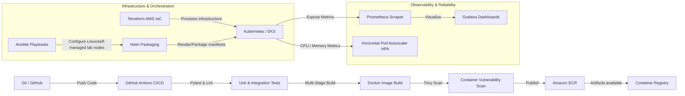

# TaskFlow — DevOps Task Management Platform

[](https://github.com/taskflow-devops/taskflow/actions/workflows/ci.yml)
[](https://github.com/taskflow-devops/taskflow/actions/workflows/security.yml)
[](LICENSE)

**TaskFlow** is a production-oriented DevOps capstone platform demonstrating the lifecycle of a containerized task-management application—from application development and testing through container security, infrastructure as code, Kubernetes orchestration, observability, and continuous delivery.

---

## 1. Project Overview & Problem Statement
Modern cloud applications demand automated delivery pipelines, zero-downtime deployments, robust observability, and strict security standards. TaskFlow serves as a baseline containerized full-stack application (React + FastAPI + PostgreSQL) operationalized using modern DevOps engineering tools (**Docker, GitHub Actions, Trivy, Terraform, Ansible, Kubernetes, Helm, Prometheus, Grafana**).

---

## 2. Complete DevOps Lifecycle Architecture



---

## 3. Technology Stack

- **Frontend**: React 18, TypeScript, Vite, Tailwind CSS, Lucide Icons
- **Backend**: Python 3.11, FastAPI, Pydantic v2, SQLAlchemy ORM, PostgreSQL, PyJWT, Passlib (bcrypt)
- **Containerization**: Docker, Multi-Stage Builds, Docker Compose
- **CI/CD**: GitHub Actions (`ci.yml`, `security.yml`, `infrastructure.yml`, `finops.yml`, `cd.yml`) — CI, IaC validation, enforced security scanning, ECR publishing, EKS deployment and smoke testing
- **Security**: Trivy Container & Filesystem Vulnerability Scanner, Non-Root Containers
- **Infrastructure as Code (IaC)**: Terraform HCL (AWS EKS, VPC, Subnets, ECR, IAM)
- **Configuration Management**: Ansible (Playbooks, Roles, Inventory)
- **Container Orchestration**: Kubernetes (Deployments, Services, ConfigMaps, Secrets, Ingress, HPA, Kustomize)
- **Packaging**: Helm 3 Charts (`helm/taskflow`)
- **Observability**: Prometheus, Grafana, ServiceMonitor and Kubernetes monitoring bootstrap

---

## 4. Repository Structure

```
taskflow-devops/
├── frontend/             # React 18 + TypeScript + Vite + Tailwind CSS
├── backend/              # Python FastAPI + SQLAlchemy + Alembic + Pytest
├── docker/               # PostgreSQL initialization and local container support
├── docker-compose.yml    # Development local stack
├── docker-compose.prod.yml # Production-hardened container stack
├── .github/workflows/    # CI, Security, Terraform, FinOps and CD GitHub Actions
├── terraform/            # AWS VPC, EKS, ECR modular IaC + remote state + workspace demo
├── ansible/              # Ansible inventories, playbooks, and node roles
├── kubernetes/           # Kustomize Base & Dev/Prod Overlays
├── helm/taskflow/        # Production Helm Chart & values templates
├── monitoring/           # Prometheus scraper configs & Grafana dashboards
├── scripts/              # Verification & load testing automation scripts
├── docs/                 # Internship mapping, interview prep, architecture docs
├── Makefile              # Cross-platform developer automation commands
└── README.md
```

---

## 5. Local Setup & Execution

### Prerequisites
- Python 3.11+, Node.js 20+, Git
- Docker Desktop (Optional for container stack)

### Quickstart (Local Development)
```bash
# 1. Clone repository
git clone https://github.com/taskflow-devops/taskflow.git
cd taskflow

# 2. Copy environment template
cp .env.example .env

# 3. Option A: Run directly with Python & Node
pip install -r backend/requirements.txt
python -m pytest backend/tests

cd frontend && npm install && npm run dev

# 4. Option B: Run full containerized stack with Docker Compose
docker compose up -d --build
```
Access the application:
- **Frontend Dashboard**: `http://localhost:3000` (or `http://localhost:80`)
- **Backend API Docs (Swagger)**: `http://localhost:8000/api/docs`
- **Health Endpoint**: `http://localhost:8000/api/health`
- **Metrics Endpoint**: `http://localhost:8000/api/metrics`

---

## 6. Kubernetes & Helm Deployment

### Deploy with Helm
```bash
# Create the runtime Secret first (never commit real credentials)
export POSTGRES_PASSWORD='replace-me'
export SECRET_KEY='replace-me-with-a-random-32-plus-character-secret'
./scripts/create-k8s-secret.sh

# Install/upgrade the canonical production chart
helm upgrade --install taskflow ./helm/taskflow \
  --values ./helm/taskflow/values-prod.yaml \
  --namespace taskflow --create-namespace \
  --set backend.image.repository=taskflow-backend \
  --set backend.image.tag=latest \
  --set frontend.image.repository=taskflow-frontend \
  --set frontend.image.tag=latest \
  --wait --wait-for-jobs --timeout 10m

# Verify Deployment
kubectl get all -n taskflow
kubectl get hpa -n taskflow
kubectl get pvc -n taskflow
```

---

### Continuous Delivery Boundary

The GitHub Actions CD workflow is designed for a real EKS deployment. It uses GitHub OIDC and an AWS IAM role supplied as `AWS_ROLE_ARN`; no long-lived cloud credentials are committed. Without the required repository secrets and an existing EKS cluster, the deployment job should not be run.

For Kubernetes, create the required runtime Secret out-of-band before deploying. See `kubernetes/base/secret.example.yaml`.

## 7. Infrastructure as Code & Configuration Management

### Terraform Infrastructure
```bash
cd terraform/environments/dev
terraform init
terraform validate
terraform plan
```

> `terraform plan` is a safe preview command. It has not been claimed as executed unless it is actually run in an AWS-configured environment.

### Ansible Playbooks
```bash
cd ansible
ansible-playbook playbooks/site.yml --syntax-check
```

---

## 8. Observability, Scaling & Reliability

- **Prometheus Scraping**: Scrapes backend `/api/metrics` every 15 seconds.
- **Grafana Dashboard**: Pre-configured JSON dashboard in `monitoring/grafana/dashboards/taskflow-dashboard.json`.
- **Horizontal Pod Autoscaler**: Configured to scale backend pods based on CPU and memory utilization. Runtime HPA behavior requires Kubernetes metrics-server.
- **SRE practices**: Example SLIs, SLOs and error-budget guidance are documented in `docs/reliability.md`.

---

## 9. FinOps & AIOps
- [FinOps Controls](docs/finops.md)
- [AIOps / Intelligent Operations](docs/aiops.md)

## 10. Comprehensive Documentation & Career Resources
- [CapStone Internship Syllabus Mapping](docs/capstone.md)
- [DevOps Culture & CALMS](docs/devops-culture.md)
- [Git Workflow](docs/git-workflow.md)
- [23 Technical Interview Q&As](docs/interview-preparation.md)
- [System Architecture Specification](docs/architecture.md)
- [Deployment Guide](docs/deployment.md)
- [Reliability & SRE](docs/reliability.md)
- [Troubleshooting Guide](docs/troubleshooting.md)
- [DevSecOps Security Policy](SECURITY.md)

---

## 11. Capstone Live Demonstration
See [Capstone Live Demonstration](docs/capstone-demo.md) for the end-to-end evaluation sequence.

## 12. Verification & Quality Assurance
Run the capstone static validation before creating the submission ZIP:
```bash
make capstone-validate
```
The script checks repository hygiene, Bash/Python syntax, YAML/JSON, and uses Terraform/Helm/kubectl/Ansible validators when those CLIs are installed. GitHub Actions performs the same checks in Linux CI.

For a live assessment, follow `docs/runtime-validation.md` and `docs/capstone-demo.md`.

---

## License
Distributed under the [MIT License](LICENSE).
