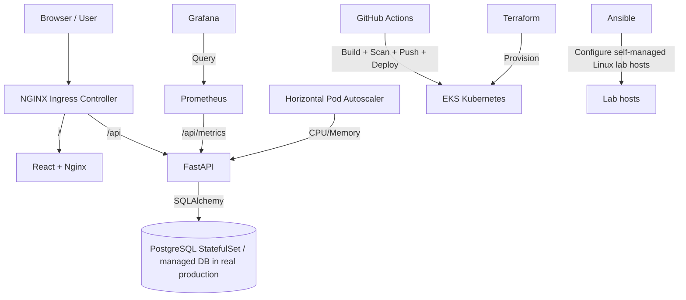

# TaskFlow System Architecture

TaskFlow is a cloud-native task-management platform with independently containerized frontend and backend services, PostgreSQL persistence, Kubernetes orchestration, automated delivery, and observability.

## Component Breakdown

1. **Frontend service**: React 18 SPA built with Vite and served by an unprivileged Nginx container on port 8080.
2. **Backend service**: FastAPI with SQLAlchemy, JWT authentication, Alembic migrations, health/readiness endpoints and Prometheus metrics.
3. **Database**: PostgreSQL 15. The training/local Kubernetes path uses a StatefulSet + PVC; a real production deployment should prefer a managed database.
4. **Orchestration**: Kubernetes Deployments, Service, Ingress, HPA, Helm and Kustomize.
5. **Delivery**: GitHub Actions builds/tests/scans images, pushes immutable Git-SHA images to ECR, deploys Helm to EKS, and runs smoke tests.
6. **Infrastructure**: Terraform provisions AWS networking, EKS, ECR and optional GitHub Actions access.
7. **Configuration management**: Ansible demonstrates Linux host configuration for self-managed lab nodes; EKS managed nodes are not configured by Ansible.
8. **Observability**: Prometheus/Grafana, ServiceMonitor, PrometheusRule, application health checks and SRE indicators.
